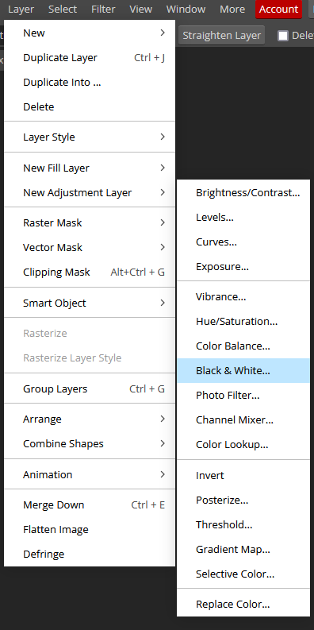
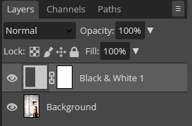
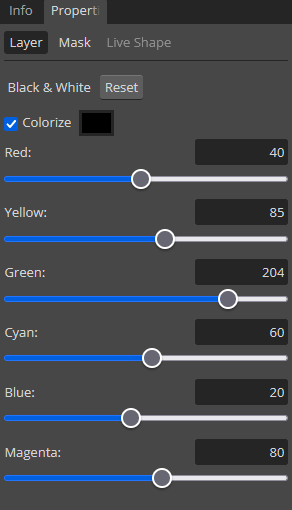
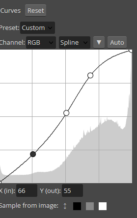
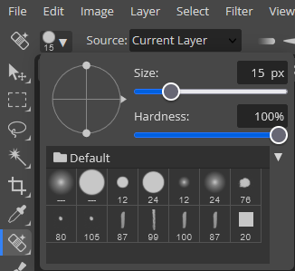
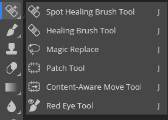

# Photopea for Beginners Activity #2: Basic Photo Edits
Let’s move on using Photopea and do some basic edits to a photo. If you have any questions, please ask!

1. Download this image for the exercise: [Unsplash](https://unsplash.com/photos/xEX_o0haX6c){:target="_blank"}
2. Open the photo in [Photopea](https://www.photopea.com/){:target="_blank"} by either clicking on the going to **File -> Open**. Find where you saved the photo and open it. If your browser automatically saved it for you, it is probably in your **Downloads** folder.
3. **Converting to Black and White**:- 
 - Click on **Layer** in the top menu (see right), then **New Adjustment Layer**, and then **Black & White**.
 - A new layer called Black & White 1 will appear in your Layers window on the right. It will sit above your Background layer (original image). The layer Properties window should already automatically open. The Black & White properties window has sliders for all the colour channels. If you do not see it, double click on the little two-tone rectangle in the left side of the Black & White layer: This will bring up the Properties window. 
  
 <button onclick="toggle('gif1')">Show / Hide Animation </button>
 

       
       

- In the Properties for the Black & White adjustment layer, there is a series of sliders that enable you to adjust the intensity for each of the tones in the image individually, giving you greater control. Try dragging some of them to see what happens. 
  
- Next, Click on **Layer** in the top main menu (see right), then **New Adjustment Layer**, and then **Curves**.
- Go into the **Curves** layer properties. Click on the diagonal line in three places to **create three evenly spaced round handles** (see first image to the right). Once the handles are there, you can grab them with your mouse and **drag them up or down** to make adjustments in your photo. The wave form in the back shows the lights and darks in your image. To the left of the waveform are the darks and the right side displays the lights. In the example screenshot, the diagonal Curve line has been dragged to give an upwards bump to the brights and a downwards bump to the darks, which is a way to slightly increase the contrast of the image, if needed.
<button onclick="toggle('gif2')">Show / Hide Animation </button>

      
      

4.**Save**:
- Whenever you see the asterisk to the right of the file name up in the upper left corner of the screen, this is an indication that you’ve made a change to your file and have not saved it.
 
- Click on **File -> Save As PSD** in the upper left corner. We are going to save this in the Photopea .psd format, which will preserve the layers for the project we are working on, and not touch the original photo. This will save a PSD copy of the file to your Downloads folder. This is a good practice if you are doing a lot of detailed work and want to save your work partway into the project in case you lose it, or if you need to stop and go do something else for a while. Note however that if you Save As PSD again, it will download a new copy with all of your latest changes, so if you have saved previous versions of the file you are working on, you will have a different version for each stage of your process. You may way to rename the files to indicate that and possibly delete the older versions once you have finalized your project. 
5.**Heal Tool**: Next we will use **Heal** to remove the visible screws in the post.
You will most likely have a bandage icon (**Healing Brush** or **Spot Healing** tool) showing in the left toolbar. If you **click and hold** on the tool, it will bring up the list of available tools in that group. Click on the **Spot Healing Brush** tool to select it.

- Once selected, a menu at the top of the software will be there with specific options for that tool. In the example here, the round, white dot with the number 19 below indicates that the brush shape of the Spot Healing tool is round and solid, and 15 pixels in size. Click on the **downward arrow** right next to it, and adjust the **Size to 25**.
- Note: You will need to make sure that the Background layer is selected: go to **Layers** window to make sure you are working in the correct layer before making Healing Tool edits.

 <button onclick="toggle('gif3')">Show / Hide Animation </button>

      
      

-  You might find it helpful to zoom in before healing. To zoom in to an area in your photo, **click on the Zoom** button (magnifying glass icon) at the bottom of the left toolbar and then click in the area you want to zoom. If you want to adjust where the image is sitting, you can **click on the Hand tool** (hand icon) right above the Zoom tool. If you’ve zoomed in too far, you can click on the **Zoom Out** button at the top left of the screen which will turn your Zoom tool into a Zoom Out tool and you can click on your image to zoom out. Once the image is in a comfortable position, you will need to **click back on the Spot Healing Brush tool again**. Use your left mouse button to **draw over the screw**. Go ahead and clean up the blemish right above it too. See to the right for a before and after.  Optionally, use the Spot Healing Brush to remove the screw at the base of the pole.
 <button onclick="toggle('gif4')">Show / Hide Animation </button>

      
      

- Use the **Zoom tool** to zoom back out to see the whole photo. 

6. **Exporting**:
To export this to a full size PNG file without the layers (Save as PSD as above to keep all the layers), click on **File -> Export As** in the upper left corner. A window will pop up with options for resizing. Leave image size and quality at 100%,  but make sure the **Format** is set to **PNG** in the dropdown in the upper right corner of the Export window. Click the **Save** button in the bottom corner when ready.

[NEXT STEP: Basic Photo Edits](image-dimensions.html){: .btn .btn-blue }

