# Photoshop for Beginners Activity #4: Changing the Colour of an Object
How to use the Hue/Saturation Adjustment layer to change object colours easily. If you have any questions, please ask!

1. Download this image for the exercise: [Dog on Pexels](https://www.pexels.com/photo/medium-short-coated-white-dog-on-white-textile-2607544/ ){:target="_blank"}
2. Open the photo in [Photopea](https://www.photopea.com/){:target="_blank"} by either clicking on the going to **File -> Open**. Find where you saved the photo and open it. If your browser automatically saved it for you, it is probably in your **Downloads** folder.
3. **Basic Hue Adjustment**:- 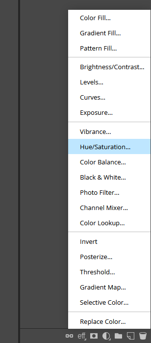
 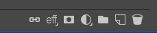
- Click on **Layer** in the top menu (see right), then **New Adjustment Layer**, and then **Hue/Saturation**, or you can quickly go to the bottom of the Layers panel and click on the half white circle icon to bring up the Adjustments layer menu and then click on Hue/Saturation. This will create a new layer over the top of the Background layer, called **Hue/Saturation 1**, and will bring up the **Properties** panel for this layer.
-  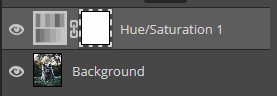
4. In the **Properties** panel click on the little **two-sided arrow button** to activate it, and then go to the photo and click on somewhere in the colour you want to change. For this example, it will be in the pink heart shaped glasses worn by the dog. You want a colour that is in the middle of the range, not too light or dark. The text next to the arrows in the Properties panel by “Range” should change to “Red” as it will recognize this colour is in the red colour range.  
 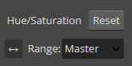
5. Next, you can click and drag the **Hue slider** in the Properties panel to see the colour of the glasses lenses change.  
 

## The results will not be perfect but there are a couple things we can do to refine things. First will be to adjust the colour range:
6. Drag the Hue slider all the way to the left.
7. In the Properties panel there is a colour spectrum with a few sliders showing what colour range has been sampled. You may notice that parts of the dog have become a little blotchy as some of the natural colours in the sampled spectrum exist in the dog’s body and ears. By moving these colour spectrum sliders around, you can adjust the specific part of the spectrum you want sampled. 
 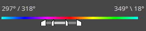
8. If you drag the handle on the right towards the left, the colour distortions in the dog’s body will start to disappear.
9. Pull the handle on the far left over to the left a bit to correct the blotchy bits in the glasses lenses.
10. With these adjustments, try dragging the Hue slider back and forth again to see the results. 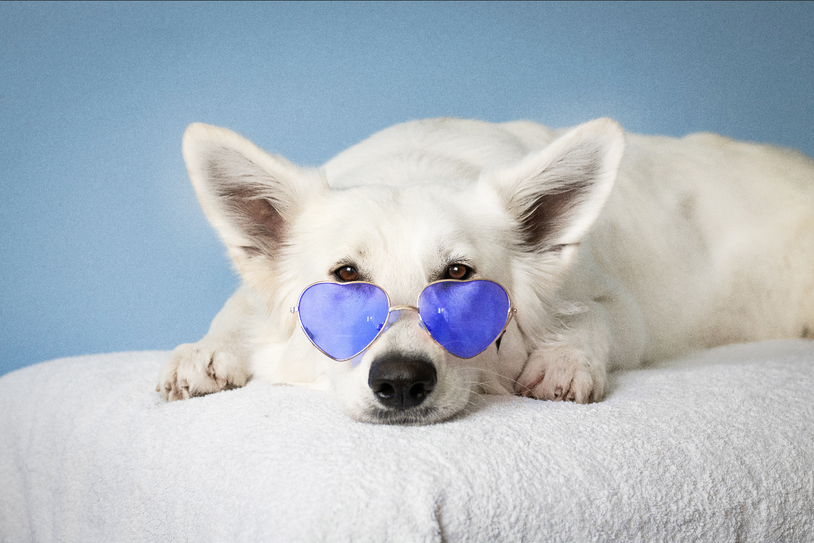
11. Save or export the image as you did in previous exercises.   

## What if you have an image with multiple parts of the same colour and only want to change one or some?
1. Download this image for the exercise: [Cat on Pexels](https://www.pexels.com/photo/selective-focus-photo-of-grey-cat-1521304/){:target="_blank"}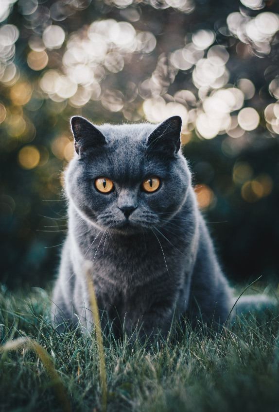
2. Open the photo in [Photopea](https://www.photopea.com/){:target="_blank"} by either clicking on the going to **File -> Open**. Find where you saved the photo and open it. If your browser automatically saved it for you, it is probably in your **Downloads** folder.
3. Go to the **Layers panel** and at the bottom click on the **half white circle icon** to bring up the **Adjustments layer menu** and then click on **Hue/Saturation**. This will create a new layer over the top of the Background layer, called **Hue/Saturation 1**, and will bring up the Properties panel for this layer.
4. In the **Properties panel** click on the little two-sided arrow button to activate it, and then go to the photo and click on somewhere in the colour you want to change. For this example, it will be in the eyes of the cat. You want a colour that is in the middle of the range, not too light or dark. The text next to the arrows in the Properties panel by “Range” should change to “Yellow” as it will recognize this colour is in the yellow colour range.
5. Next, you can click and drag the Hue slider in the Properties panel to see the colour of the eyes change.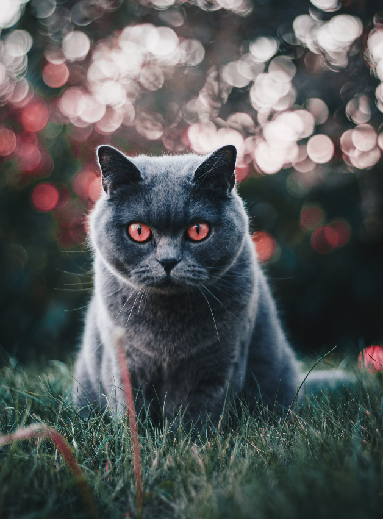
6. You will notice at this point that the yellow round circles of the dappled out of focus light points in the background (commonly called “bokeh”) are changing colour along with the eyes, as well as some of the grass in the foreground. Follow the next steps to isolate only the eyes for the hue change.
7. Click on the **white square in the Hue/Saturation layer** in the Layers panel to make sure it is selected (dashed lines around it).
8. Go over to the left sidebar menu and click on the **colour picker** and choose **black**. Then select the **Brush Tool**. You can make the brush size bigger in the drop down menu at the top.   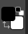
9. Brush over the image to create a mask over any area you don’t want colour changes to happen. You will see the white square in the Layers panel turn black in the areas you have painted over.  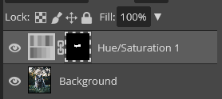
10. If you accidentally brush over an area you don’t want masked, you can either use the Undo function, or you can change the Brush colour to white and brush white over the same area to unmask it.
11. Go back to the Hue slider and drag it back and forth until the eyes are the colour you want. At this point, the rest of the image should stay the same. 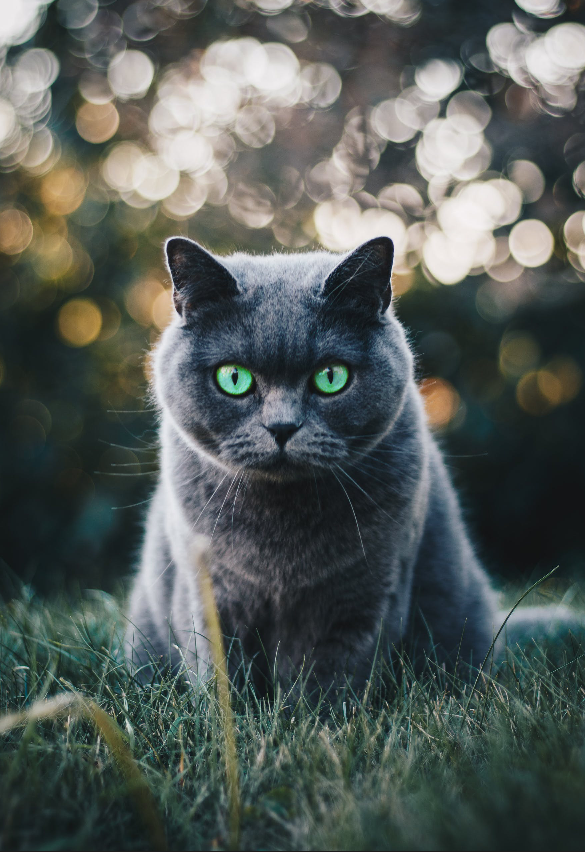
12. Save or export the image as you did in previous exercises.
13. Here are some good images to practice on:
- [Apples on Pexels](https://www.pexels.com/photo/dried-eucalyptus-branch-and-apples-on-a-white-surface-4856745/){:target="_blank"} (change one of the apples to another colour)
- [Toy Car on Pexels](https://www.pexels.com/photo/selective-focus-photography-of-yellow-car-toy-243206/){:target="_blank"} (change the colour of the car - this one is challenging due to the warm tones of the lighting in the whole image and through the windows of the car)
[NEXT STEP: Bonus Activities Removing Someone/Something from a Photo](removing-parts-photo.html){: .btn .btn-blue } or 
[Earn a Badge](informal-credentials.html){: .btn .btn-blue }
